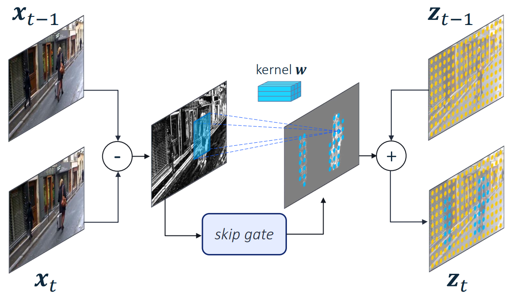

# Skip-Conv

This repository provides the Skip-Convolution module presented in.

[Amirhossein Habibian](https://habibian.github.io/), 
[Davide Abati](https://davideabati.info/), 
[Taco S. Cohen](https://tacocohen.wordpress.com/), 
[Babak Ehteshami Bejnordi](http://babakint.com/), 
"Skip-Convolutions for Efficient Video Processing", CVPR 2021.[[arxiv]](https://arxiv.org/abs/2104.11487)

Qualcomm AI Research (Qualcomm AI Research is an initiative of Qualcomm Technologies, Inc)

## Reference
If you find our work useful for your research, please cite:
```latex
@inproceedings{skipconv,
  title={Skip-Convolutions for Efficient Video Processing},
  author={Habibian, Amirhossein and Abati, Davide and Cohen, Taco and Bejnordi, Babak Ehteshami},
  booktitle={Proceedings of the IEEE Conference on Computer Vision and Pattern Recognition},
  year={2021}
}
```

## Method
Skip-Convolutions allow to save computation whenever applying a 2D CNN to video frames.
By decomposing the convolution on the current frame as a sum of the convolved past frame and the residual frame, we take advantage of the sparsity of the latter to reduce the amount of operations.

We increase the savings by further sparsifying the residual. Given a residual frame or feature map, a gating module is queried for binary maps highlighting the locations where updated representations are needed. 
In the image, only blue locations are updated. In all other orange locations, no update is provided and the representations are copied from the previous timestep.

This repository contains the implementation of both gating modules discussed in the paper. 
* **Norm Gates**: we apply a threshold epsilon to the norm of the residual. This strategy requires no training, and can be easily applied to any CNN to save computation.
* **Gumbel Gate**: we feed the residual to a parametric function (a single convolution in our implementation). Gumbel gates require finetuning the network, but achieve better performances with respect to Norm Gates.

## Install
Code has been tested with `python3.6` and `pytorch==1.6.0`.
```bash
conda create -n skipconv python=3.6
conda activate skipconv
conda install pytorch=1.6.0
```


## Example use
The file [`lib/skip_conv.py`](lib/skip_conv.py) contains the definition of the Skip Convolution class.

The file [`main.py`](main.py) highlights how to feed a SkipConv model during training (stateless, feed temporal clips) and inference (stateful, recursively feed single frames).
````
python3.6 main.py
````
The script will call two functions showcasing how the operator should be used in training and testing within a backbone network. As such, the reported example feeds random tensors and prints out the resulting shapes. 


To instantiate the different versions of the operator described in the paper, you can change the arguments in `main.conv_ops`.
Specifically, you can experiment with
* `gate_type` (`GateType.NORM_GATE` or `GateType.GUMBEL_GATE`): selects among the two types of gates available, namely Norm-gates and Gumbel-gates.
* `norm_gate_type` (`NormGateType.INPUT` or `NormGateType.OUTPUT`): when Norm-gates are selected, selects among Input-norm or Output-norm gates.
* `norm_gate_eps`: the threshold applied to Norm-gates. Only relevant if Norm-gates are selected.
* `gumbel_gate_structure`: The dimension of the structuring element of Gumbel-gates. Can be 1, 2, 4 or 8.